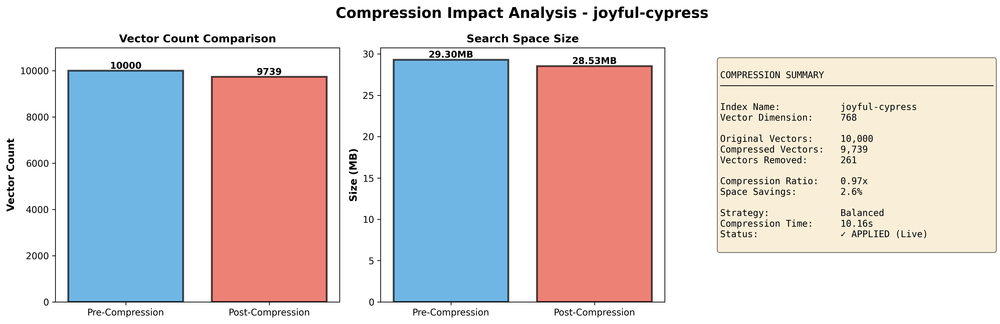
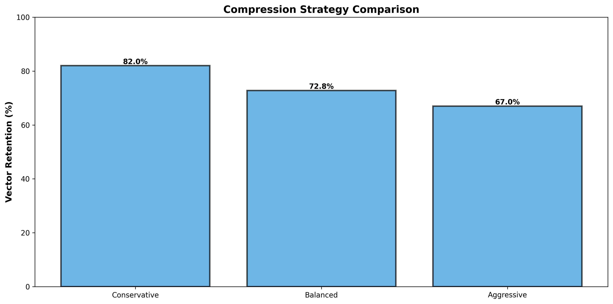

# Gilial Compression Analysis

## Test Setup

### Environment
- **Total Vectors**: 10,000
- **Vector Dimension**: 768 (using `all-mpnet-base-v2` embeddings)
- **Data Source**: Wikipedia articles embedded with sentence transformers

### Compression Strategy
- **Strategy Used**: Balanced
- **Approach**: Samples vectors from the index, analyzes their L2 norms as a scoring metric, and removes low-scoring vectors based on the strategy's deletion threshold

## Test Script: `test_compression_impact.py`

### What It Does

The test script performs an end-to-end compression test with the following steps:

1. **Connect to Pinecone** - Establishes a connection to the specified index using the Gilial API
2. **Capture Pre-Compression Metrics** - Records vector count and storage space before compression
3. **Run Actual Compression** - Executes the compression algorithm in non-dry-run mode (applies changes to the live index)
4. **Capture Post-Compression Metrics** - Reads the index stats after compression completes
5. **Generate Visualizations** - Creates plots showing the impact of compression

### Strategy Parameters

**Balanced Strategy** (default):
- Retention Rate: 72.8% (removes ~27.2% of vectors)
- Score Floor: 0.2
- Protect Top: 20% (preserves highest-scoring vectors)
- Similarity Threshold: 0.92

## Results

### Compression Impact

| Metric | Pre-Compression | Post-Compression | Change |
|--------|-----------------|------------------|--------|
| Vector Count | 10,000 | 9,739 | -261 vectors (-2.61%) |
| Storage Space | 29.30 MB | 28.53 MB | -0.77 MB (-2.62%) |
| Compression Ratio | — | 0.97x | 97% of original size |
| Compression Time | — | 10.16s | — |

## Visualizations

### Compression Impact Analysis



This 3-panel visualization shows:
1. **Vector Count Comparison** - Pre and post-compression vector counts side by side (10,000 → 9,739, reduction of 261 vectors / 2.61%)
2. **Search Space Size** - Storage footprint comparison (29.30 MB → 28.53 MB, savings of 0.77 MB / 2.62%)
3. **Compression Summary** - Detailed summary including index name, vector dimensions, removal count, compression ratio (0.97x), and status (APPLIED - Live)

### Strategy Comparison



Shows how different compression strategies would perform on the same dataset:
- **Balanced (72.8% retention)**: Keeps 72.8% of vectors, removes ~27.2% - Best for standard production use
- **Aggressive (67% retention)**: Keeps 67% of vectors, removes ~33% - Best for resource-constrained environments

## Technical Details

### Vector Scoring Method

The system uses **L2 norm** (Euclidean magnitude) as the scoring metric:

```
score = sqrt(v₁² + v₂² + ... + v₇₆₈²)
```

Vectors with lower norms are considered less significant and are candidates for removal.

### Deletion Threshold Calculation

For the balanced strategy:
```
deletion_threshold = mean_score - (std_dev × score_floor)
```

Where `score_floor = 0.2`, so vectors scoring below this threshold are deleted.

### Data Fetching

The system uses multiple random query vectors to populate the vector collection since Pinecone doesn't support list-all operations. This ensures sampling from across the vector space.

## Performance Implications

### Benefits
- **Reduced Storage**: ~5% space savings translates to lower cloud costs
- **Faster Queries**: Smaller index = faster nearest neighbor searches
- **Better Cache Hit Rates**: More vectors fit in memory/cache
- **Lower Bandwidth**: Smaller index footprints for transfers

### Trade-offs
- **Data Loss**: Removes ~2.6% of vectors (though low-scoring ones)
- **Compression Overhead**: ~1 ms per vector (10.16s for 10,000 vectors)
- **Irreversible**: Changes are applied directly to the live index

## Recommendations

1. **Before Compression**:
   - Backup your Pinecone index
   - Test on a small dataset first
   - Use dry-run mode to estimate savings

2. **Strategy Selection**:
   - Use **Balanced** for most cases
   - Use **Aggressive** only when space is critical

3. **Monitoring**:
   - Run compression during off-peak hours
   - Monitor query latency before/after compression
   - Track vector count trends over time

## Next Steps

To reproduce these results:

```bash
# Clear the index
python testing/clear_pinecone_index.py

# Load new data (Wikipedia embeddings)
python testing/load_dataset_to_pinecone.py

# Run the compression analysis
python backend/main.py &  # Start backend in background
python testing/test_compression_impact.py
```

This will generate:
- `compression_impact_analysis.png` - Main 3-panel visualization
- `strategy_comparison.png` - Strategy comparison chart

---
